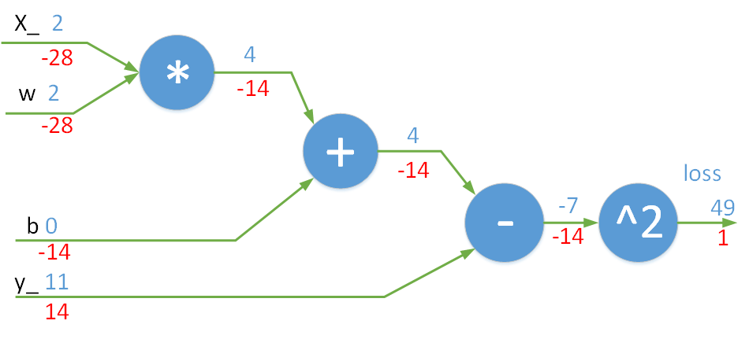
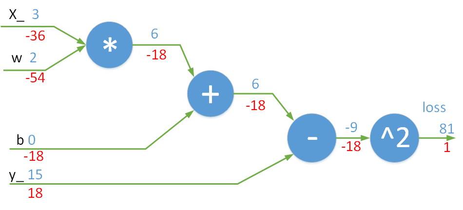

## 梯度反向传播手工推导与TensorFlow automatic differentiation

具体内容请看我的[博文](https://robertlexis.github.io/2018/06/07/%E6%89%8B%E5%B7%A5-Backpropagation-%E6%8E%A8%E5%AF%BC%E4%B8%8E-TensorFlow-automatic-differentiation/)或者本仓库中的Jupyter Notebook。